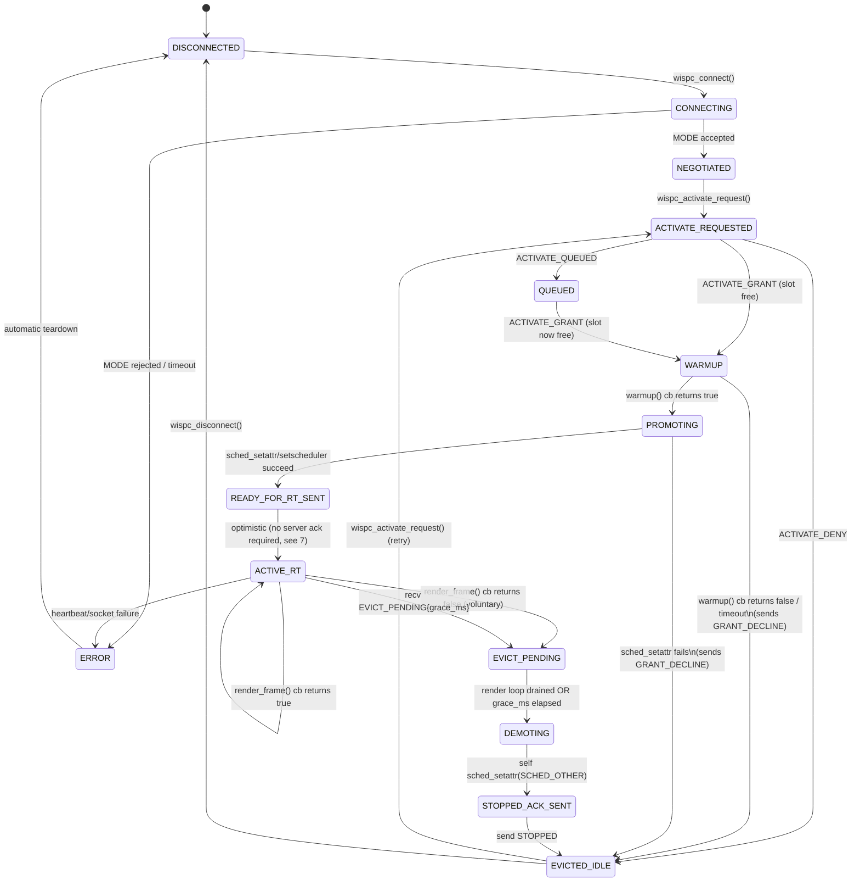
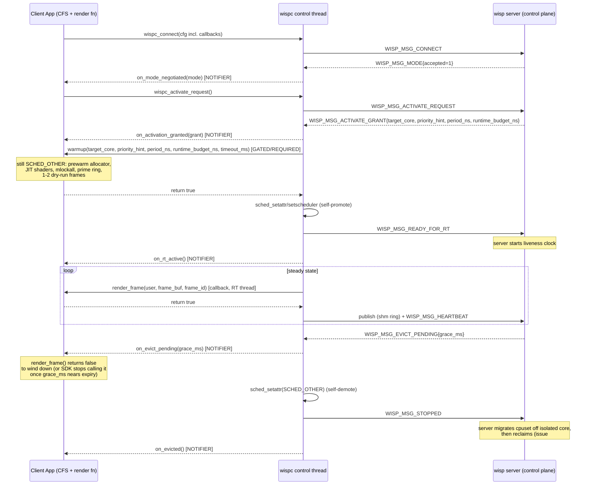

# RT Client Lifecycle: State Machine & Callback Event Planning

Status: DRAFT — design exploration for the "bring-your-own-render-thread,
callback-heavy" client_sdk architecture. Not yet implemented. Supersedes/
formalizes the discussion in GitHub issues #11, #13, #33, #34.

This document does **not** modify the wire protocol or client_sdk code. It is
the planning artifact that will inform:

1. The new `wisp_msg_kind_t` additions (protocol/include/wisp/wire.h)
2. The server-side per-session state machine (server/src/session/session_table.h)
3. The client_sdk's internal state machine + public callback registration API

## 1. Scope

A "client app" using wispc is decomposed into two thread bundles:

- **CFS bundle**: ordinary best-effort threads doing business logic (input,
  networking, asset/db IO, audio, etc.). Scheduled normally, not core-isolated.
- **RT bundle**: the wispc control thread (SCHED_FIFO once promoted) + the
  app-provided render thread/callback (SCHED_DEADLINE once promoted). This is
  the thread bundle that actually produces frames into the shm ring.

The client app does not run its own state machine. It registers callbacks and
opt-in flags with wispc at `wispc_connect()`-time (or via a config struct);
wispc's control thread runs the state machine and invokes callbacks at the
right time, on the right thread, with the right guarantees.

## 2. Client-side lifecycle states

These are wispc's *internal* states (client-side), distinct from but
correlated with the server's per-session `wisps_session_state_t`
(CONNECTED/NEGOTIATED/ACTIVE/REJECTED — today's states, pre-RT-handshake).
The client-side state machine is strictly finer-grained because it also
models what's happening entirely locally (warmup, scheduling promotion) that
the server never sees directly.

| # | State                | Meaning                                                                                          | Entered from                          |
|---|-----------------------|---------------------------------------------------------------------------------------------------|----------------------------------------|
| 1 | `DISCONNECTED`        | No socket. Initial state and terminal state after clean shutdown.                                 | (initial) / `STOPPED`, any error path  |
| 2 | `CONNECTING`          | Socket opening + `WISP_MSG_CONNECT` in flight, awaiting `WISP_MSG_MODE`.                           | `DISCONNECTED`                         |
| 3 | `NEGOTIATED`          | Mode accepted. Not yet requested/granted activation. Idle, CFS-priority only.                      | `CONNECTING`                           |
| 4 | `ACTIVATE_REQUESTED`  | Sent `WISP_MSG_ACTIVATE_REQUEST`, awaiting GRANT/DENY.                                             | `NEGOTIATED`                           |
| 5 | `QUEUED`              | Activation acknowledged-but-deferred; another client holds the slot (background-queued).           | `ACTIVATE_REQUESTED` (server responds "queued", see 5.1) |
| 6 | `WARMUP`              | Granted; still SCHED_OTHER. Running warmup callback (allocator/shader JIT/prefault/dry-run frames). | `ACTIVATE_REQUESTED`, `QUEUED`         |
| 7 | `PROMOTING`           | Warmup callback returned success; wispc is calling `sched_setattr`/`sched_setscheduler` on its own RT thread(s). | `WARMUP`                |
| 8 | `READY_FOR_RT_SENT`   | Self-promotion done; sent `WISP_MSG_READY_FOR_RT`, awaiting server ack / first liveness window.    | `PROMOTING`                             |
| 9 | `ACTIVE_RT`           | Steady state: render thread spinning, publishing frames, SCHED_DEADLINE/FIFO live.                 | `READY_FOR_RT_SENT`                    |
| 10| `EVICT_PENDING`       | Received `WISP_MSG_EVICT_PENDING{grace_ms}`. Cooperative wind-down in progress.                    | `ACTIVE_RT`                            |
| 11| `DEMOTING`            | Render loop drained/stopped; wispc demoting its own threads to SCHED_OTHER before cpuset migration (safety ordering, see issue #34). | `EVICT_PENDING`, forced-eviction path |
| 12| `STOPPED_ACK_SENT`    | Demotion done; sent `WISP_MSG_STOPPED`, cpuset reclaim now safe server-side.                        | `DEMOTING`                              |
| 13| `EVICTED_IDLE`        | Back to non-RT, no longer active; may re-request activation (loop back to `ACTIVATE_REQUESTED`) or disconnect. | `STOPPED_ACK_SENT`, forced-eviction timeout |
| 14| `ERROR`               | Unrecoverable protocol/local error (bad handshake, warmup callback hard-failed, socket reset). Client app is notified and must decide: retry from `DISCONNECTED` or exit. | any state |

Notes:
- **5. `QUEUED`** formalizes "background-queued" from the issue #33
  discussion — today's protocol has no message for this (ACTIVATE_REQUEST
  either gets GRANT or DENY immediately); this needs a new
  `WISP_MSG_ACTIVATE_QUEUED` (see §4).
- **9 vs 6-8**: the WARMUP → PROMOTING → READY_FOR_RT_SENT → ACTIVE_RT chain
  is entirely issue #13/#34's split-responsibility handshake formalized into
  states. Each arrow is a place a callback and/or wire message fires (see §3/§4).
- **11 (`DEMOTING`)** is the client-side mirror of issue #34's mandated
  ordering: **demote scheduling class -> migrate cpuset -> reclaim**. The
  client only ever performs step 1 (demote itself); the server performs
  steps 2-3 after receiving `WISP_MSG_STOPPED` (or after a forced-timeout,
  where the server does step 1 itself as the documented backstop, then 2-3).
- **14 (`ERROR`)** is a catch-all; the actual callback contract (§3) always
  gives the client app a definite outcome (success/fail) rather than leaving
  it to infer state from timeouts, per the "notifier events, opt-in" design
  goal.

## 3. Event classification legend

Every transition in §4/§5 is tagged with one of:

- **GATED** — wispc calls a client-provided callback and *blocks the state
  machine* on its return value (and/or a timeout). The callback's outcome
  decides the next state. This is for things the client app must be given a
  chance to prepare for / veto / take variable time on (e.g. warmup).
- **NOTIFIER** — wispc invokes a client-provided callback *after* the
  transition already happened, fire-and-forget, on a best-effort basis (never
  blocks the state machine; if no callback is registered, nothing happens).
  This is for telemetry/observability the app may act on if it wants to, but
  never must.
- **INTERNAL** — no client involvement at all; purely bookkeeping inside
  wispc (e.g. socket-level retries). Not exposed as a callback.
- **REQUIRED** — like GATED, but there's no meaningful "opt out": if the app
  doesn't register a callback, wispc supplies a no-op default (e.g. an empty
  warmup that returns success immediately), so the state machine never stalls
  on a callback the app didn't bother to provide.

## 4. State transition matrix

| From                | To                  | Trigger                                                  | Class     | Callback (proposed name)         | Notes |
|---------------------|---------------------|-----------------------------------------------------------|-----------|-----------------------------------|-------|
| `DISCONNECTED`      | `CONNECTING`        | app calls `wispc_connect()`                                | INTERNAL  | -                                  | socket() + connect() + send CONNECT |
| `CONNECTING`        | `NEGOTIATED`        | recv `WISP_MSG_MODE{accepted=1}`                           | NOTIFIER  | `on_mode_negotiated(mode)`         | app may want to size buffers/UI to negotiated mode |
| `CONNECTING`        | `ERROR`             | recv `WISP_MSG_MODE{accepted=0}` / connect() fails / timeout | NOTIFIER | `on_connect_failed(reason)`        | |
| `NEGOTIATED`        | `ACTIVATE_REQUESTED`| app calls `wispc_activate_request()` (or auto, see §6)     | INTERNAL  | -                                  | |
| `ACTIVATE_REQUESTED`| `WARMUP`            | recv `WISP_MSG_ACTIVATE_GRANT{...}` (slot free immediately) | NOTIFIER  | `on_activation_granted(grant)`     | fires before warmup callback so app can log/update UI |
| `ACTIVATE_REQUESTED`| `QUEUED`            | recv new `WISP_MSG_ACTIVATE_QUEUED{position}`               | NOTIFIER  | `on_activation_queued(position)`   | new message, see §7 |
| `QUEUED`            | `WARMUP`            | recv `WISP_MSG_ACTIVATE_GRANT{...}` (slot now free)         | NOTIFIER  | `on_activation_granted(grant)`     | same callback as above |
| `ACTIVATE_REQUESTED`| `EVICTED_IDLE`      | recv `WISP_MSG_ACTIVATE_DENY{reason}`                       | NOTIFIER  | `on_activation_denied(reason)`     | app decides whether to retry |
| `WARMUP`            | `PROMOTING`         | client warmup callback returns success                      | **GATED (REQUIRED)** | `warmup(target_core, priority_hint, period_ns, runtime_budget_ns, timeout_ms) -> bool` | see issue #34: allocator prewarm, shader JIT, `mlockall`, ring priming, 1-2 dry-run frames — all *inside* this callback, still SCHED_OTHER |
| `WARMUP`            | `EVICTED_IDLE`      | warmup callback returns failure, or exceeds timeout          | NOTIFIER  | `on_warmup_failed(reason)`         | wispc sends a new "decline grant" message back to server (see §7) so the slot isn't held open |
| `PROMOTING`         | `READY_FOR_RT_SENT` | wispc's own `sched_setattr`/`sched_setscheduler` calls succeed | INTERNAL | -                                  | client callback is not involved in the syscalls themselves — only decided *when* to attempt them (end of warmup) |
| `PROMOTING`         | `EVICTED_IDLE`      | `sched_setattr` fails (e.g. no `CAP_SYS_NICE`)               | NOTIFIER  | `on_promotion_failed(errno)`       | must gracefully decline; cannot silently stay SCHED_OTHER while server thinks client is RT |
| `READY_FOR_RT_SENT` | `ACTIVE_RT`         | server ack (implicit: server starts its liveness clock; see §7 — do we need an explicit ack message?) | NOTIFIER | `on_rt_active()` | render thread callback loop is now allowed to run |
| `ACTIVE_RT`         | `ACTIVE_RT`         | each produced frame                                         | INTERNAL  | `render_frame(user, frame_buf, frame_id) -> bool` | the actual per-frame render callback; app-provided render thread function, NOT the control thread. Return false = app-signaled voluntary stop |
| `ACTIVE_RT`         | `EVICT_PENDING`     | recv `WISP_MSG_EVICT_PENDING{grace_ms}`                      | NOTIFIER  | `on_evict_pending(grace_ms)`       | app should start winding down its render loop now |
| `ACTIVE_RT`         | `EVICT_PENDING`     | app's own `render_frame` callback returns false (voluntary stop) | INTERNAL | - | client-initiated eviction; wispc synthesizes the same wind-down path |
| `EVICT_PENDING`     | `DEMOTING`          | render loop observed to have stopped (last frame drained) OR `grace_ms` elapsed | INTERNAL | - | either path converges here |
| `DEMOTING`          | `STOPPED_ACK_SENT`  | wispc demotes its own RT threads to SCHED_OTHER (self-demote, mirrors #34 ordering) | INTERNAL | - | |
| `STOPPED_ACK_SENT`  | `EVICTED_IDLE`      | send `WISP_MSG_STOPPED` (fire-and-forget; server does cpuset reclaim) | NOTIFIER | `on_evicted()` | app may re-request activation or exit |
| `ACTIVE_RT`         | `ERROR`             | liveness/heartbeat send fails, socket reset                 | NOTIFIER  | `on_connection_lost()`             | forced path: server-side backstop demote/evict happens without client cooperation |
| `EVICTED_IDLE`      | `ACTIVATE_REQUESTED`| app calls `wispc_activate_request()` again                  | INTERNAL  | -                                  | re-entrant loop; same states, no special-casing |
| `EVICTED_IDLE`      | `DISCONNECTED`      | app calls `wispc_disconnect()`                               | INTERNAL  | -                                  | |
| any                 | `ERROR`             | unrecoverable protocol violation / malformed message         | NOTIFIER  | `on_protocol_error(kind, detail)`  | last-resort catch-all |
| `ERROR`             | `DISCONNECTED`      | wispc tears down socket/threads automatically after error    | INTERNAL  | -                                  | app must call `wispc_connect()` fresh to retry — no auto-reconnect by default (opt-in policy, see §6) |

## 5. Additional notifier events (not tied to a state transition)

These fire *within* a stable state (usually `ACTIVE_RT`) and never change
the state machine. All are opt-in; app registers a callback or leaves it
NULL and nothing fires. This is the "notifier events" bucket from the
original design brief — things a client *may* want to know but never
*must* react to for correctness.

| Event                          | Fires when                                                                 | Proposed callback                          | Rationale |
|---------------------------------|------------------------------------------------------------------------------|---------------------------------------------|-----------|
| Render hiccup (recoverable)      | control thread observes a missed publish deadline within tolerance (still under the liveness-timeout threshold from issue #33) | `on_render_hiccup(missed_deadlines_count, last_frame_age_ns)` | app might want to log/adapt quality, but server doesn't care yet |
| Server telemetry push            | server proactively sends periodic stats (core temp, cgroup throttle counters, etc.) — **new message, see §7** | `on_server_telemetry(telemetry_blob)`       | purely informational; format TBD, probably opaque/versioned blob so it doesn't churn the core protocol |
| Heartbeat sent                   | each successful `WISP_MSG_HEARTBEAT` send                                    | `on_heartbeat_sent(frame_id)`               | low-value, but cheap opt-in for apps doing their own health dashboards |
| DMA-BUF ack/refused               | recv `WISP_MSG_DMABUF_ACK{accepted}` (already exists in protocol today)       | `on_dmabuf_result(accepted)`                | already-implemented message, just needs a callback hook wired up |
| Mode renegotiation offered        | server proposes a different mode mid-session (does not exist in protocol yet — flagged as a future consideration, not designing now) | (future) | out of scope for this pass; today's model negotiates once at connect and never changes |
| CFS→RT bundle handoff notice      | control thread is about to hand off to the app's render thread for the first time (i.e., just before `render_frame` is called for frame 0) | `on_render_thread_starting()`               | lets app do last-second per-thread setup (e.g. TLS, thread name) distinct from the warmup gated callback, which runs on the *control* thread, not the render thread |
| CFS↔RT cross-core IPC message     | business-logic thread posted a "scene changed" style message to the renderer (see §8, cross-thread IPC design) | `on_scene_dirty(payload)`                   | this is the "cross core ipc between render thread and business logic" ask from the original brief; modeled as a lock-free SPSC notification, not a state transition |

## 6. Gated-event deep dive

Gated events are the highest-stakes part of this design since they block
the state machine and have real timing consequences on an RT path. Two
gated events exist today in this plan:

### 6.1 `warmup()` — WARMUP -> PROMOTING

```c
typedef bool (*wispc_warmup_fn)(void *user,
                                 uint32_t target_core,
                                 uint32_t priority_hint,
                                 uint64_t period_ns,
                                 uint64_t runtime_budget_ns,
                                 uint32_t timeout_ms);
```

- Called on the **control thread**, never the render thread (render thread
  doesn't exist yet at this point in the lifecycle).
- `target_core`/`priority_hint`/`period_ns`/`runtime_budget_ns` come straight
  off the (extended) `WISP_MSG_ACTIVATE_GRANT` payload from issue #33 — these
  are server-computed, not client-asserted, so the callback is purely
  informational/preparatory for the client, never negotiating.
- Client is expected to: pre-warm allocators, JIT/compile shaders or
  pipeline state, prefault its stack, `mlockall`, prime the SPSC frame ring,
  and run 1-2 dry-run frames — all while still `SCHED_OTHER` (issue #34's
  explicit safety requirement; must not touch `frame_fd` during dry runs).
- Returns `true` -> proceed to `PROMOTING`. Returns `false` or exceeds
  `timeout_ms` -> `EVICTED_IDLE` with a decline sent server-side (new
  message, §7) so the server can immediately offer the slot to the next
  queued client instead of waiting out a full liveness timeout.
- Default (no callback registered): returns `true` immediately — i.e. an app
  that skips all the RT ceremony is still going to be promoted immediately,
  it's just accepting the tail latency risk of not warming up. This matches
  the REQUIRED classification (see §3) — the state machine always advances,
  never silently stalls.

### 6.2 `render_frame()` — the steady-state ACTIVE_RT loop

```c
typedef bool (*wispc_render_fn)(void *user, void *frame_buf, uint64_t frame_id);
```

- Runs on the app-provided render thread, which wispc has already promoted
  to `SCHED_DEADLINE`/`SCHED_FIFO` (per `priority_hint`) by the time this is
  ever called.
- This is the "single callback" shape from issue #11
  (`pgipc_writer_run(ctx, writer_render_fn fn, void *user, free_fn)`),
  carried forward unchanged into this design — wispc owns the RT thread and
  its lifecycle; the app just supplies the per-tick body.
- Return `true` to keep going; return `false` to voluntarily start eviction
  (client-initiated wind-down, folded into the same `EVICT_PENDING` path a
  server-initiated eviction uses — see the transition matrix row for this).
- Not really "gated" in the timeout sense (it's the steady-state loop, not a
  one-shot handshake), but it is blocking in the sense that wispc's tick
  scheduling waits on its return before publishing/kicking `frame_fd`. Listed
  here for completeness since it's the other callback that isn't a simple
  fire-and-forget notifier.

## 7. New wire messages required (protocol-level; not yet implemented)

This section enumerates every wire-format change the state machine above
actually depends on. Everything else in the tables above rides on existing
messages/local state only.

| New message                              | Direction       | Payload (proposed)                                              | Replaces / extends | Issue |
|--------------------------------------------|-----------------|---------------------------------------------------------------------|---------------------|-------|
| `WISP_MSG_ACTIVATE_GRANT` (extend, not new) | server -> client | add `uint32_t target_core`, `uint32_t priority_hint`, `uint64_t period_ns`, `uint64_t runtime_budget_ns` | existing `wisp_grant_msg_t` | #33 |
| `WISP_MSG_ACTIVATE_QUEUED`                 | server -> client | `uint32_t queue_position`                                            | new — today ACTIVATE_REQUEST only gets GRANT/DENY | (derived from #33's "background-queued" language) |
| `WISP_MSG_READY_FOR_RT`                    | client -> server | (empty; presence is the signal)                                      | new                 | #33 |
| `WISP_MSG_GRANT_DECLINE`                   | client -> server | `uint32_t reason` (warmup failed / promotion failed)                  | new — lets client fail fast out of a grant without waiting for a liveness timeout | (derived from §6.1 above; not explicitly in #33 but needed to make the fast-fail path work) |
| `WISP_MSG_EVICT_PENDING`                   | server -> client | `uint32_t grace_ms`                                                   | new, replaces today's immediate hard evict | #33 |
| `WISP_MSG_STOPPED`                         | client -> server | (empty; presence is the signal)                                      | new                 | #33 |
| `WISP_MSG_LIVENESS_TIMEOUT`                 | server -> client | (empty; informational, sent just before forced eviction, best-effort) | new — passive frame-rate enforcement per #33 | #33 |
| `WISP_MSG_TELEMETRY` (optional/future)       | server -> client | opaque versioned blob (TBD)                                          | new                 | (derived from §5's `on_server_telemetry`; explicitly flagged as lower-priority/optional) |

Open question flagged in the transition matrix (§4): does `READY_FOR_RT_SENT
-> ACTIVE_RT` need an explicit server ack message, or is "server's liveness
clock started, first heartbeat/publish succeeded" sufficient implicit
confirmation? Leaning toward **no new message** — issue #33 says the
liveness clock starts "from receipt of [`READY_FOR_RT`]," i.e. server-side
bookkeeping only; client can optimistically transition to `ACTIVE_RT` the
instant it sends `READY_FOR_RT`, and only fall back to `ERROR` if the very
first heartbeat/publish fails. Recorded here as a decision, not left
ambiguous, since it affects whether `on_rt_active()` fires optimistically or
after a round-trip.

## 8. Mermaid: client-side state machine



## 9. Mermaid: server-side per-session state machine (companion view)

This is the *server's* view of the same handshake — a superset of today's
`wisps_session_state_t` (`CONNECTED`/`NEGOTIATED`/`ACTIVE`/`REJECTED`),
extended to track the RT handshake phases so the admin/control planes can
answer "why is this client not producing frames yet" without cross-
referencing client-only state.

```mermaid
stateDiagram-v2
    [*] --> CONNECTED

    CONNECTED --> NEGOTIATED: recv CONNECT, send MODE{accepted=1}
    CONNECTED --> REJECTED: send MODE{accepted=0}

    NEGOTIATED --> GRANTED_WARMUP: recv ACTIVATE_REQUEST, slot free\n(send ACTIVATE_GRANT)
    NEGOTIATED --> QUEUED: recv ACTIVATE_REQUEST, slot busy\n(send ACTIVATE_QUEUED)

    QUEUED --> GRANTED_WARMUP: slot frees up\n(send ACTIVATE_GRANT)
    QUEUED --> NEGOTIATED: client disconnects while queued

    GRANTED_WARMUP --> ACTIVE_RT: recv READY_FOR_RT\n(start liveness clock)
    GRANTED_WARMUP --> NEGOTIATED: recv GRANT_DECLINE\n(offer slot to next queued client)

    ACTIVE_RT --> ACTIVE_RT: recv HEARTBEAT (within period)
    ACTIVE_RT --> EVICTING_COOPERATIVE: server-initiated evict\n(send EVICT_PENDING{grace_ms})
    ACTIVE_RT --> EVICTING_FORCED: LIVENESS_TIMEOUT\n(no heartbeat within 3-5x period)

    EVICTING_COOPERATIVE --> NEGOTIATED: recv STOPPED\n(demote already done client-side;\nserver migrates cpuset + reclaims)
    EVICTING_COOPERATIVE --> EVICTING_FORCED: grace_ms elapses with no STOPPED

    EVICTING_FORCED --> NEGOTIATED: server force-demotes (sched_setattr SCHED_OTHER)\n-> migrates cpuset -> reclaims\n(issue #34 ordering, server as backstop)

    NEGOTIATED --> [*]: recv DISCONNECT
    REJECTED --> [*]: connection closed
```



## 10. Mermaid: end-to-end sequence (happy path + cooperative eviction)

Shows both sides together for one full client lifecycle: connect through
active RT frame production, then a server-initiated cooperative eviction.
Callback names from §4/§6 are annotated on the client side to make clear
which wire message triggers which callback.



## 11. Open questions (deliberately unresolved here)

These came up while building this matrix but are genuinely separate design
decisions, not blockers to reviewing the shape above:

1. **CFS↔RT cross-core IPC mechanism** (§5's `on_scene_dirty`): lock-free
   SPSC ring vs futex-based wake vs eventfd — needs its own short design
   pass once the state machine shape is agreed on, since the underlying
   primitive is a client_sdk-internal question, not a wire-protocol one.
2. **Callback registration API shape**: single big config struct at
   `wispc_connect()` time (JACK/CLAP-style) vs individual
   `wispc_on_xxx(ctx, fn, user)` setters called before connect. Leaning
   struct (matches issue #11's `pgipc_writer_run(ctx, fn, user, free_fn)`
   precedent) but not decided here.
3. **`WISP_MSG_TELEMETRY` payload format**: opaque blob is a placeholder;
   needs real fields once it's clear what the server actually monitors
   (issue mentions "core temp, cgroup throttle counters" as examples only).
4. **Reconnect/retry policy**: is auto-reconnect after `ERROR` ever
   something wispc should offer as an opt-in policy, or should it always be
   the app's responsibility to call `wispc_connect()` again? Currently
   assumed "always app's responsibility" (§4 note) — flagged for
   confirmation.
5. **Forced-eviction client-side visibility**: when the server force-demotes
   a client that never cooperated, does the client ever find out (e.g. next
   `wispc_connect()` attempt gets a distinguishable error), or is it purely
   silent from the client's perspective (process presumably already
   hung/dead if it got force-evicted)? Not modeled above; assumed the latter
   for now.

## 12. Explicit non-goals of this pass

- No wire-format bytes/struct layout for the new messages in §7 — field
  lists only, not final `struct wisp_*_msg_t` definitions.
- No actual `sched_setattr`/cgroup code. This is pure protocol/callback
  shape design.
- No decision on whether `wispc_activate_request()` is ever called
  automatically by wispc itself (e.g. immediately after negotiation) vs.
  always explicit — assumed explicit/app-driven throughout this doc, called
  out wherever relevant, but worth confirming before implementation.
- Does not touch/replace the *existing, already-implemented* messages
  (`CONNECT`/`MODE`/`ACTIVATE_REQUEST`/`ACTIVATE_DENY`/`HEARTBEAT`/
  `DISCONNECT`/`DMABUF_ANNOUNCE`/`DMABUF_ACK`) beyond the one documented
  extension to `ACTIVATE_GRANT`'s payload.
- Negotiated-fps removal (explicitly requested by the user) is reflected
  here only insofar as `render_frame()` is called as fast as the app
  produces frames and passive liveness/`LIVENESS_TIMEOUT` is the only
  rate-related server action — no separate "removal" changes are needed
  since this design never reintroduces a negotiated cadence.

## 13. Queue representation & admin-initiated forced switch

This section addresses a real gap in §2/§4/§9: with `QUEUED` now a
formal state, what happens when an admin issues
`WISPS_ADMIN_MSG_SWITCH_REQUEST{client_id}` (already-implemented, see
`server/src/admin/admin_proto.h`) while other clients are already queued?
Naive designs risk a queue-capacity mismatch that could silently drop or
misorder a client that was legitimately waiting.

### 13.1 Decision: the queue is a derived view, not a second data structure

`QUEUED` is a `wisps_session_state_t` value on a session's *existing* slot
in the fixed `WISPS_SESSION_MAX_CLIENTS`-entry session table — it is not a
separate list, ring, or FIFO that sessions get pushed into/popped out of.
"Queue position" (for `WISP_MSG_ACTIVATE_QUEUED{queue_position}`, §7) is
computed on demand by scanning the session table for `state == QUEUED`,
ordered by request timestamp (a field already needed anyway — reuse
`last_heartbeat_monotonic`-style timestamping or add one).

Consequences:

- The queue's capacity is *structurally* `WISPS_SESSION_MAX_CLIENTS - 1`
  (every connected session except the one holding `ACTIVE_RT`), because
  there is only one array a session can ever occupy a slot in. There is no
  second capacity to reconcile, so `queue_size >= session_table_size` is
  not a real invariant to maintain — it's true by construction, always.
- A session can never be "in the queue but not in the session table" or
  vice versa, so there is no scenario where accepting a new queue entrant
  requires evicting an existing one to make room. That failure mode is
  eliminated by not having two structures to keep in sync.
- Cost: recomputing position is an O(n) scan over at most 8 entries,
  triggered only when the queue actually changes (a session
  joins/leaves/gets granted) — negligible, and avoids ever maintaining a
  redundant ordering structure that could drift from the session table.

### 13.2 Forced-switch semantics (admin-initiated preemption)

When admin sends `SWITCH_REQUEST{client_id}` naming a session that is not
currently `ACTIVE_RT` (whether it's `NEGOTIATED`, `QUEUED`, or even
mid-`WARMUP` for a *different* pending grant — edge case, see 13.3):

1. **The currently-`ACTIVE_RT` session is evicted through the normal
   cooperative eviction pipeline already defined in §4/§9** — same
   `EVICT_PENDING` -> `DEMOTING` -> `STOPPED_ACK_SENT` path as any other
   eviction (grace period, self-demote ordering per issue #34, etc.).
   Admin-initiated eviction is not a special/shortcut path; it reuses the
   one eviction mechanism this doc already defines.
2. **The evicted session lands in `NEGOTIATED`, not back in `QUEUED`.**
   This is the key decision that avoids the ambiguity you raised: if it
   auto-rejoined the queue, at what position? Front (unfair to whoever was
   already waiting) or back (surprising if it was just active)? Rather
   than invent a policy for that, the evicted session is simply idle
   afterward and must call `wispc_activate_request()` again if it wants
   back in — identical to any other voluntary-stop eviction. No special
   case in the state machine for "was this eviction admin-initiated."
3. **The admin's named target session gets a server-initiated grant that
   jumps the queue**, regardless of whether it was `NEGOTIATED` (never
   asked) or already `QUEUED` behind others. This is intentional: admin
   authority is an explicit, out-of-band override of the normal FIFO
   fairness policy, not an implicit side effect a queued client needs to
   defend against. It is exactly as surprising as it should be — an admin
   explicitly said "activate this one now."
4. **Every other queued session is completely untouched.** Their
   `wisps_session_t` slot, state, and relative request-timestamp ordering
   don't change at all. Only the *computed* `queue_position` numbers shift
   in their next `ACTIVATE_QUEUED` update (since whichever session the
   admin just promoted is no longer "ahead" of them, or never was). Because
   §13.1 means there's no structural entry to remove, "untouched" is the
   natural behavior, not something requiring extra logic to guarantee.

### 13.3 Edge case: admin targets a session mid-warmup for someone else's grant

Not actually possible under this model — only one session can be in
`GRANTED_WARMUP` (server-side) / `WARMUP`..`READY_FOR_RT_SENT`
(client-side) at a time, because a grant is only ever issued for the one
`ACTIVE_RT` slot once it's free (§9). If admin targets that same session
while it's mid-warmup, it's a no-op (already the grant target). If admin
targets a *different* session while another is mid-warmup for a
newly-freed slot, the in-flight warmup is not preempted — admin's request
is treated as a new queue-jump request that will apply once the current
warmup resolves (success -> becomes `ACTIVE_RT`, immediately followed by
the eviction path in 13.2; failure/decline -> slot is still free, admin's
target gets the grant next as it would have anyway). This keeps the
warmup handshake itself uninterruptible mid-flight, which matches issue
#34's safety ordering (never yank scheduling state out from under a
session mid-transition).

### 13.4 Wire-format impact

None. `WISPS_ADMIN_MSG_SWITCH_REQUEST` already just carries a
`client_id` (see `admin_proto.h`) — this section is entirely
state-machine semantics on top of the existing message, not a protocol
change. The admin control-plane message set does not need a
queue-specific request/response variant.

---

Next step once this is reviewed: turn §7 into real `wisp_msg_kind_t`
additions + payload structs in `protocol/include/wisp/wire.h`, then the
server-side session table extension (§9's states), then the client_sdk
callback registration API + internal state machine (§8), in that order —
each as its own follow-up branch/PR per the earlier "defer to a future
session" agreement.


